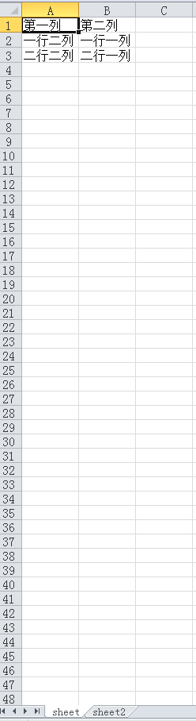

# JsonExportExcel

> [json导出excel](https://cuikangjie.github.io/JsonExportExcel/) 支持中文

> [EXAMPLE](example/index.html)

> es6请查看[js-export-excel](https://github.com/cuikangjie/js-export-excel)版本

> 记得点star

> by kin

## 安装方法

```shell
# clone项目
 git clone  https://github.com/cuikangjie/JsonExportExcel.git
```

## 使用方法


1.引入js (dist目录下JsonExportExcel.min.js)

```html
<script src="dist/JsonExportExcel.min.js"></script>
```

2.js代码

```javascript
var option={};

option.fileName = 'excel'
option.datas=[
  {
    sheetData:[{one:'一行一列',two:'一行二列'},{one:'二行一列',two:'二行二列'}],
    sheetName:'sheet',
    sheetFilter:['two','one'],
    sheetHeader:['第一列','第二列']
  },
  {
    sheetData:[{one:'一行一列',two:'一行二列'},{one:'二行一列',two:'二行二列'}]
  }
];
var toExcel=new ExportJsonExcel(option);
toExcel.saveExcel();
```

## option

- datas 数据

  ```
  /*多个sheet*/
  /*每个sheet为一个object */
  [{
  sheetData:[], // 数据
  sheetName:'', // sheet名字
  sheetFilter:[], //列过滤
  sheetHeader:[] // 第一行
  }]
  ```

- fileName 下载文件名(默认：download)

### sheet option

- sheetName sheet名字(可有可无)(默认sheet1)

- sheetHeader 标题（excel第一行数据）

  ```javascript
  sheetHeader:['第一列','第二列']
  ```

- sheetData 数据源(必须)

  ```javascript
  <!--两种形式-->
  <!--第一种 object-->
  [{one:'一行一列',two:'一行二列'},{one:'二行一列',two:'二行二列'}]
  <!--第二种 arrary-->
  [['一行一列','一行二列'],['二行一列','二行二列']]
  ```


- sheetFilter 列过滤(只有在data为object下起作用)(可有可无)

  ```javascript
  sheetFilter=['two','one'];

  ```

## 效果预览
   

## 浏览器支持
  > ie 10+

## 赞助

  

> 请我喝杯咖啡 ￥28

## log

- 2017.4.27

  > 增加标题配置

  >增加多个sheet功能

  >优化代码

  >支持safiri浏览器
